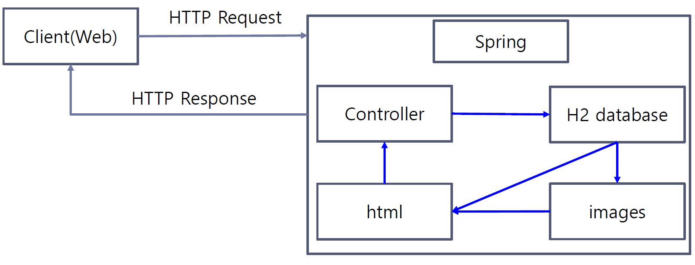

# 2023-1-SoftWareProejct1-SpringBoot
광운대학교 컴퓨터정보공학부 3-1 전공 과목 소프트웨어프로젝트1 Spring Boot 사진 소개 홈페이지

## Program Architecture

## Development Environment
- IDE: Intellij IDEA Community Edition
- language: Java
- Spring Boot Version: Spring Boot 2.7.11
- Java Version: JDK 11
- Database: h2
- Build Tool: Gradle
- Object Relational Mapping(ORM): Spring Data JPA
- View Template Engine: Thymeleaf

## 화면 구성
- [x] Index.html
- [x] Upload.html
- [x] ImageView.html

## 구현 체크 리스트
- Index.html
    - [x] 사진과 간단한 타이틀 업로드 최신순으로 시각화
    - [x] 타이틀의 최대 길이 20
    - [x] 사진과 타이틀은 모두 클릭 가능하게 처리, 클릭할 시 ImageView.html 을 통해 관련 내용 시각화
    - [x] "사진 올리기" 버튼 클릭 시 Upload.html로 이동
    - [x] “localhost:8080/”과 “localhost:8080/index.html” 모두 접근 가능하도록 처리
    - [x] 추가: 파일 1MB 이상인 경우 예외 처리
  
- Upload.html
    - [x] 파일은 이미지만 받을 수 있도록 처리
    - [x] 이미지는 .jpg, .jpeg, .png 파일만 업로드 가능
    - [x] Title의 최대 길이 20, Comment의 최대 길이 100으로 제한
    - [x] "전송" 버튼 클릭 시(업로드 완료 후), Index.html 로 이동
  
- ImageView.html
    - [x] Index.html에서 누른 사진 또는 타이틀에 대한 정보 시각화
    - [x] "삭제" 버튼 클릭 시 시 DB에서 제거
    - [x] "수정" 버튼 클릭 시 Upload.html로 이동 후 데이터 수정